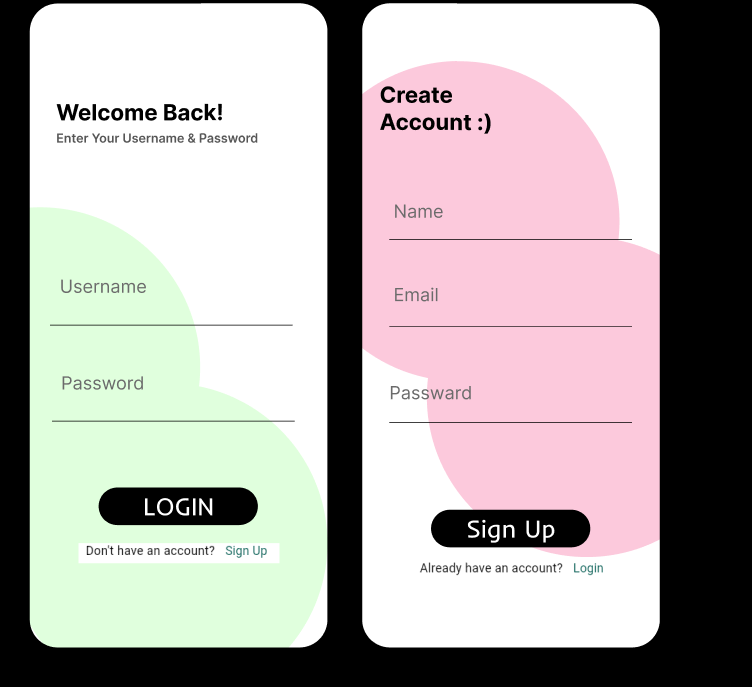

# ChatKaro

A modern, cross-platform chat application built with Flutter. ChatKaro enables real-time messaging, user authentication, and profile management, providing a seamless chat experience across Android, iOS, web, Windows, macOS, and Linux.

---

## 🚀 Features

- User authentication (sign up, login)
- Real-time chat messaging
- User profile editing
- Onboarding and welcome screens
- Animated splash screen
- User list and chat screens
- Cross-platform support (Android, iOS, Web, Windows, macOS, Linux)

---

## 📸 Screenshots



---

## 🛠️ Getting Started

### Prerequisites
- [Flutter SDK](https://flutter.dev/docs/get-started/install)
- [Dart SDK](https://dart.dev/get-dart) (usually included with Flutter)
- [Firebase Project](https://firebase.google.com/)

### Installation

1. **Clone the repository:**
   ```bash
   git clone https://github.com/your-username/chatkaro.git
   cd chatkaro
   ```
2. **Install dependencies:**
   ```bash
   flutter pub get
   ```
3. **Configure Firebase:**
   - Add your `google-services.json` (Android) and `GoogleService-Info.plist` (iOS) to the respective directories.
   - Update `lib/firebase_options.dart` as needed.
4. **Run the app:**
   ```bash
   flutter run
   ```

---

## 📁 Folder Structure

```
chatkaro/
├── android/           # Android native files
├── assets/            # Lottie animations and images
├── ios/               # iOS native files
├── lib/               # Main Flutter/Dart code
│   ├── models/        # Data models
│   ├── screens/       # UI screens
│   ├── services/      # Business logic/services
│   └── widgets/       # Reusable widgets
├── test/              # Unit/widget tests
├── web/               # Web support files
├── windows/           # Windows support files
├── macos/             # macOS support files
├── linux/             # Linux support files
├── pubspec.yaml       # Flutter dependencies
└── README.md          # Project documentation
```

---

## 📦 Dependencies

Key dependencies (see `pubspec.yaml` for full list):
- `firebase_core`
- `firebase_auth`
- `cloud_firestore`
- `lottie`
- `flutter_native_splash`

---

## 🤝 Contributing

Contributions are welcome! Please open issues and submit pull requests for new features, bug fixes, or improvements.

1. Fork the repository
2. Create your feature branch (`git checkout -b feature/YourFeature`)
3. Commit your changes (`git commit -m 'Add some feature'`)
4. Push to the branch (`git push origin feature/YourFeature`)
5. Open a pull request

---

## 📄 License

This project is licensed under the MIT License. See the [LICENSE](LICENSE) file for details.
